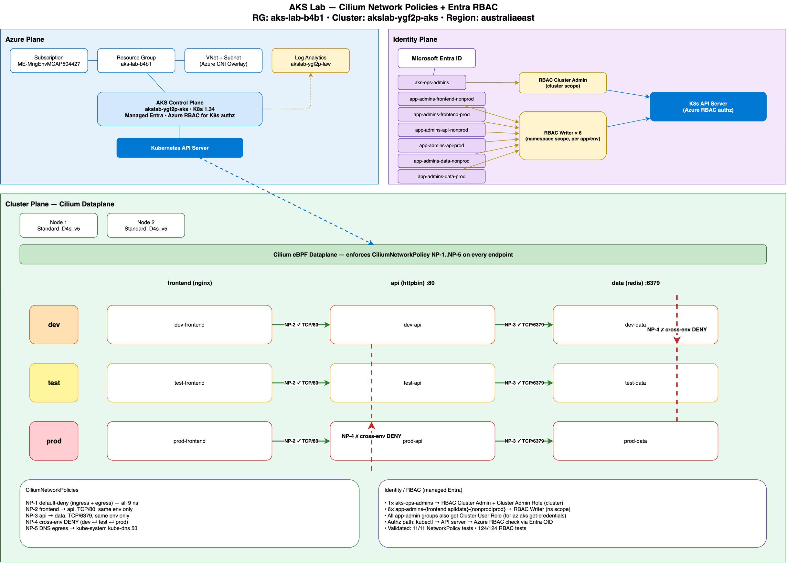

# aks — AKS Lab: Cilium Network Policies + Entra RBAC

Hands-on lab demonstrating two AKS security primitives, built with **Bicep** (infra) and **bash** (deploy + test):

1. **AKS with Azure CNI Overlay + Cilium dataplane** → pod-to-pod and namespace-to-namespace restriction with **CiliumNetworkPolicy**.
2. **Entra ID integration** → AKS-managed Entra + Azure RBAC for Kubernetes Authorization, with seven persona Entra groups (`aks-ops-admins` + 6 × `aks-app-admins-<app>-<env>`) mapped to scoped roles.

Nine sample workloads (3 apps × 3 envs) drive the policy + RBAC tests.

See **[PLAN.md](./PLAN.md)** for the full design and phased plan.
See **[ARCHITECTURE.md](./ARCHITECTURE.md)** for diagrams.

## Status

✅ **Deployed + validated** (2026-05-21)

| Component | Status |
|---|---|
| AKS cluster `akslab-ygf2p-aks` (Cilium overlay, managed Entra, Azure RBAC) | Running |
| 7 Entra groups + 19 role assignments | Applied |
| 9 namespaces (dev/test/prod × frontend/api/data) | Created |
| 9 sample app pods (nginx/httpbin/redis) | Running |
| 5 Cilium policies (NP-1..NP-5) | Applied |
| NetworkPolicy tests | **11/11 ✅** |
| RBAC tests | **124/124 ✅** |

**Resource group:** `aks-lab-b4b1` (Australia East) — see lab tracker for current cost / status.

## Architecture



The lab is organised as three cooperating planes:

- **Azure plane** — the subscription / resource group / VNet hosting the AKS control plane (`akslab-ygf2p-aks`, K8s 1.34, Azure CNI Overlay + Cilium dataplane) wired into Log Analytics workspace `akslab-ygf2p-law`.
- **Identity plane** — AKS-managed Entra ID with **7 Entra groups** (`aks-ops-admins` + 6 × `aks-app-admins-<app>-<env>`) mapped through **Azure RBAC for Kubernetes Authorization** to either cluster scope (ops) or per-namespace scope (app admins). The K8s API server delegates authz decisions to Azure RBAC using the caller's Entra OID.
- **Cluster plane** — 2 × `Standard_D4s_v5` nodes running the Cilium eBPF dataplane, which enforces **NP-1..NP-5** across the 3 × 3 namespace grid (envs `dev|test|prod` × tiers `frontend|api|data`). NP-1 default-denies everything; NP-2/NP-3 allow `frontend→api` and `api→data` within the same env; NP-4 blocks any cross-env traffic; NP-5 permits DNS egress to `kube-system`.

Editable source: [`docs/architecture.drawio`](docs/architecture.drawio) (SVG also exported at [`docs/architecture.svg`](docs/architecture.svg)).

## Quick start

```bash
# 1. Provision (idempotent; takes ~10 min for AKS)
RG=aks-lab-$(openssl rand -hex 2)
./scripts/deploy.sh $RG

# 2. Entra groups (creates 7 groups in your tenant + writes ~/workspace/tfvars/aks-lab-groups.env)
./scripts/setup-entra.sh

# 3. Azure RBAC role assignments at the AKS / namespace scopes
./scripts/setup-rbac.sh $RG

# 4. Apps + policies
./scripts/deploy-apps.sh
./scripts/apply-policies.sh

# 5. Full validation (NP + RBAC)
./scripts/run-tests.sh           # = test-network-policy.sh + test-rbac.sh
```

Results land in `tests/results/network/` and `tests/results/rbac/` (per-case JSON + a `SUMMARY.md`).

## Personas

| Group | Role | Scope |
|---|---|---|
| `aks-ops-admins` | RBAC Cluster Admin + Cluster Admin Role | cluster |
| `aks-app-admins-frontend-nonprod` | RBAC Reader | `dev-frontend`, `test-frontend` |
| `aks-app-admins-frontend-prod`    | RBAC Reader | `prod-frontend` |
| `aks-app-admins-api-nonprod`      | RBAC Reader | `dev-api`, `test-api` |
| `aks-app-admins-api-prod`         | RBAC Reader | `prod-api` |
| `aks-app-admins-data-nonprod`     | RBAC Reader | `dev-data`, `test-data` |
| `aks-app-admins-data-prod`        | RBAC Reader | `prod-data` |

All app-admin groups also receive **Cluster User Role** at the cluster scope so members can `az aks get-credentials`.

## Network policies

| ID | Intent |
|---|---|
| NP-1 | Default-deny ingress + egress in every lab namespace |
| NP-2 | `frontend → api` on TCP/80 (same env only) |
| NP-3 | `api → data` on TCP/6379 (same env only) |
| NP-4 | Cross-env deny (dev ↔ prod ingress) |
| NP-5 | DNS egress to `kube-dns` (UDP/TCP 53) cluster-wide |

## Notes / lessons learned

- `kubectl auth can-i --as=<oid>` does **not** propagate the Entra OID extra Azure RBAC needs — Azure returns `"no opinion for this non AAD user"`. Use a raw SubjectAccessReview with `spec.extra.oid` (see `scripts/test-rbac.sh`).
- Cilium endpoint policy is realised asynchronously after pod start; ephemeral test pods need a short sleep before sending traffic.
- TCP probes for silent protocols (e.g. Redis on 6379) must use `nc -z` (connect-only), not `curl telnet://` (which waits for server data).
- Probe pods must carry the same `app=` label as the source service or no CNP selects them and you get false positives/negatives.
- Broad `ingressDeny.fromEndpoints` selectors easily catch same-env traffic too; scope each cross-env deny to one direction (see `policies/np-4-cross-env-deny.yaml`).

## Repo layout

```
bicep/             # AKS + VNet + Log Analytics modules
manifests/         # namespaces + 3 sample apps (frontend / api / data)
policies/          # 5 Cilium / NetworkPolicy YAMLs (NP-1..NP-5)
scripts/           # deploy.sh, setup-entra.sh, setup-rbac.sh, deploy-apps.sh,
                   # apply-policies.sh, run-tests.sh, test-network-policy.sh, test-rbac.sh
tests/results/     # Generated test output (per-case JSON + SUMMARY.md)
PLAN.md            # Design + phased build plan
ARCHITECTURE.md    # Diagrams
```
